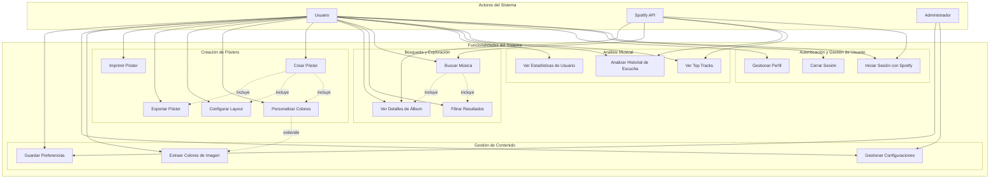
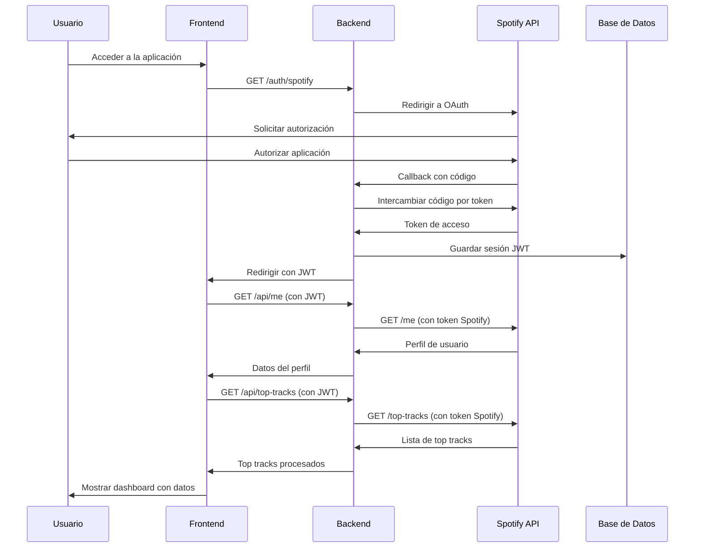
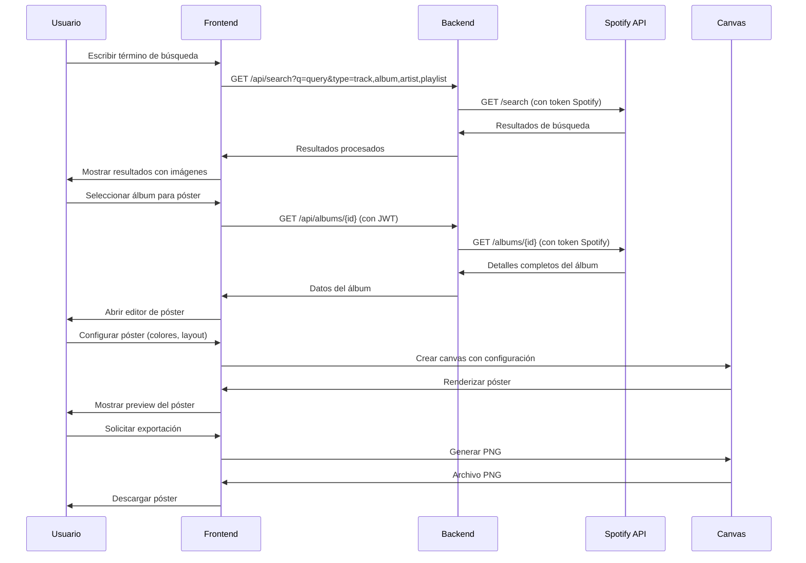
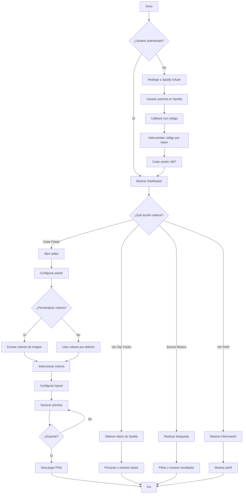
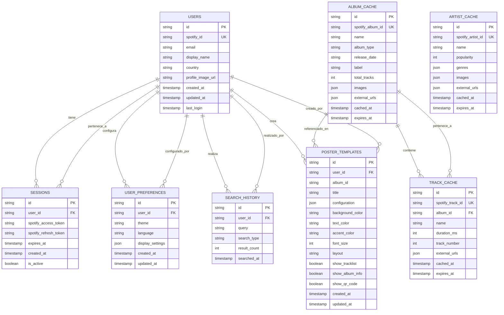

# DIAGRAMAS UML - HISTORYSONG

## 1. Diagrama de Casos de Uso



---

## 2. Diagramas de Secuencia

### 2.1 Flujo de Autenticación y Obtención de Top Tracks



### 2.2 Flujo de Búsqueda Musical y Creación de Póster



---

## 3. Diagrama de Actividades

### 3.1 Flujo Principal de la Aplicación



---

## 4. Diseño de Base de Datos

### 4.1 Diagrama Entidad-Relación



### 4.2 Esquema de Base de Datos SQL

```sql
-- Tabla de Usuarios
CREATE TABLE users (
    id UUID PRIMARY KEY DEFAULT gen_random_uuid(),
    spotify_id VARCHAR(255) UNIQUE NOT NULL,
    email VARCHAR(255),
    display_name VARCHAR(255) NOT NULL,
    country VARCHAR(10),
    profile_image_url TEXT,
    created_at TIMESTAMP DEFAULT CURRENT_TIMESTAMP,
    updated_at TIMESTAMP DEFAULT CURRENT_TIMESTAMP,
    last_login TIMESTAMP
);

-- Tabla de Sesiones
CREATE TABLE sessions (
    id UUID PRIMARY KEY DEFAULT gen_random_uuid(),
    user_id UUID NOT NULL REFERENCES users(id) ON DELETE CASCADE,
    spotify_access_token TEXT NOT NULL,
    spotify_refresh_token TEXT NOT NULL,
    expires_at TIMESTAMP NOT NULL,
    created_at TIMESTAMP DEFAULT CURRENT_TIMESTAMP,
    is_active BOOLEAN DEFAULT true
);

-- Tabla de Preferencias de Usuario
CREATE TABLE user_preferences (
    id UUID PRIMARY KEY DEFAULT gen_random_uuid(),
    user_id UUID NOT NULL REFERENCES users(id) ON DELETE CASCADE,
    theme VARCHAR(50) DEFAULT 'light',
    language VARCHAR(10) DEFAULT 'es',
    display_settings JSONB,
    created_at TIMESTAMP DEFAULT CURRENT_TIMESTAMP,
    updated_at TIMESTAMP DEFAULT CURRENT_TIMESTAMP
);

-- Tabla de Historial de Búsquedas
CREATE TABLE search_history (
    id UUID PRIMARY KEY DEFAULT gen_random_uuid(),
    user_id UUID NOT NULL REFERENCES users(id) ON DELETE CASCADE,
    query TEXT NOT NULL,
    search_type VARCHAR(100) NOT NULL,
    result_count INTEGER DEFAULT 0,
    searched_at TIMESTAMP DEFAULT CURRENT_TIMESTAMP
);

-- Tabla de Plantillas de Pósters
CREATE TABLE poster_templates (
    id UUID PRIMARY KEY DEFAULT gen_random_uuid(),
    user_id UUID NOT NULL REFERENCES users(id) ON DELETE CASCADE,
    album_id VARCHAR(255),
    title VARCHAR(255) NOT NULL,
    configuration JSONB NOT NULL,
    background_color VARCHAR(7) DEFAULT '#FFFFFF',
    text_color VARCHAR(7) DEFAULT '#000000',
    accent_color VARCHAR(7) DEFAULT '#1DB954',
    font_size INTEGER DEFAULT 16,
    layout VARCHAR(20) DEFAULT 'vertical',
    show_tracklist BOOLEAN DEFAULT true,
    show_album_info BOOLEAN DEFAULT true,
    show_qr_code BOOLEAN DEFAULT false,
    created_at TIMESTAMP DEFAULT CURRENT_TIMESTAMP,
    updated_at TIMESTAMP DEFAULT CURRENT_TIMESTAMP
);

-- Tabla de Caché de Álbumes
CREATE TABLE album_cache (
    id UUID PRIMARY KEY DEFAULT gen_random_uuid(),
    spotify_album_id VARCHAR(255) UNIQUE NOT NULL,
    name VARCHAR(500) NOT NULL,
    album_type VARCHAR(50),
    release_date DATE,
    label VARCHAR(255),
    total_tracks INTEGER,
    images JSONB,
    external_urls JSONB,
    cached_at TIMESTAMP DEFAULT CURRENT_TIMESTAMP,
    expires_at TIMESTAMP NOT NULL
);

-- Tabla de Caché de Tracks
CREATE TABLE track_cache (
    id UUID PRIMARY KEY DEFAULT gen_random_uuid(),
    spotify_track_id VARCHAR(255) UNIQUE NOT NULL,
    album_id UUID NOT NULL REFERENCES album_cache(id) ON DELETE CASCADE,
    name VARCHAR(500) NOT NULL,
    duration_ms INTEGER,
    track_number INTEGER,
    external_urls JSONB,
    cached_at TIMESTAMP DEFAULT CURRENT_TIMESTAMP,
    expires_at TIMESTAMP NOT NULL
);

-- Tabla de Caché de Artistas
CREATE TABLE artist_cache (
    id UUID PRIMARY KEY DEFAULT gen_random_uuid(),
    spotify_artist_id VARCHAR(255) UNIQUE NOT NULL,
    name VARCHAR(500) NOT NULL,
    popularity INTEGER,
    genres JSONB,
    images JSONB,
    external_urls JSONB,
    cached_at TIMESTAMP DEFAULT CURRENT_TIMESTAMP,
    expires_at TIMESTAMP NOT NULL
);

-- Índices para optimización
CREATE INDEX idx_users_spotify_id ON users(spotify_id);
CREATE INDEX idx_sessions_user_id ON sessions(user_id);
CREATE INDEX idx_sessions_expires_at ON sessions(expires_at);
CREATE INDEX idx_search_history_user_id ON search_history(user_id);
CREATE INDEX idx_search_history_searched_at ON search_history(searched_at);
CREATE INDEX idx_poster_templates_user_id ON poster_templates(user_id);
CREATE INDEX idx_album_cache_expires_at ON album_cache(expires_at);
CREATE INDEX idx_track_cache_album_id ON track_cache(album_id);
CREATE INDEX idx_artist_cache_expires_at ON artist_cache(expires_at);
```

---

## 5. Resumen de la Arquitectura UML

### **Actores Identificados:**
1. **Usuario**: Usuario final de la aplicación
2. **Spotify API**: Servicio externo de música
3. **Administrador**: Usuario con privilegios especiales

### **Casos de Uso Principales:**
- **17 Casos de Uso** cubriendo todas las funcionalidades
- **Autenticación OAuth 2.0** con Spotify
- **Análisis musical** y estadísticas
- **Búsqueda avanzada** en catálogo
- **Creación de pósters** personalizados
- **Gestión de contenido** y preferencias

### **Flujos de Secuencia:**
- **Autenticación y obtención de datos**
- **Búsqueda y creación de pósters**

### **Modelo de Datos:**
- **9 Entidades principales** con relaciones bien definidas
- **Sistema de caché** para optimización
- **Historial de búsquedas** y preferencias
- **Plantillas de pósters** personalizables

### **Características Técnicas:**
- **Arquitectura modular** y escalable
- **Separación clara** de responsabilidades
- **Optimización de consultas** con índices
- **Gestión de sesiones** segura con JWT
